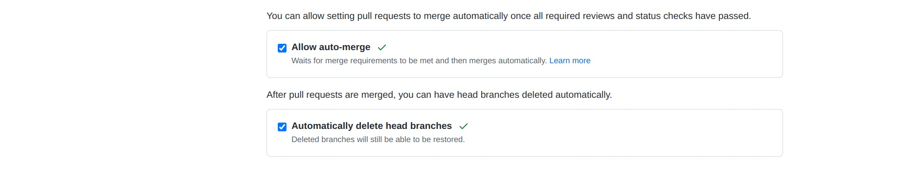
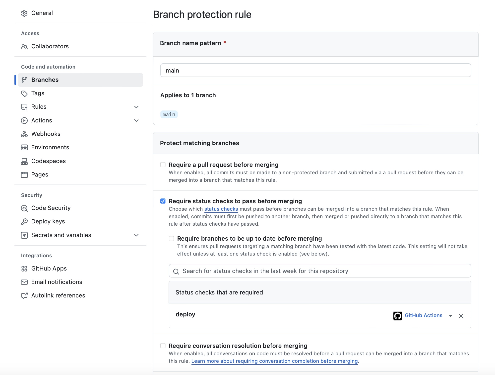

# Route53/DNS base Setup for LMA using CDK

Route 53 Setup for LMA

Output -> A configured Route53 Setup for

dev.lma.neura-legal.de (used for Development)

and

lma.neura-legal.de (used for production)

## Prerequisites

* Node V20
* A working installation of [AWS CDK V2](https://aws.amazon.com/cdk/).

### For deployments ony your local maschine

* A working install of the [AWS CLI](https://aws.amazon.com/cli/)
* Some way to get an AWS Session Token. For that [AWSume](https://awsu.me) is recommended

## Useful commands

* `cdk deploy`      deploys this stack
* `cdk diff`        compares deployed stack with current state
* `cdk synth`       emits the synthesized CloudFormation template
* `cdk destroy`     destroys this stack

## Doing a deployment from your local machine

- ```npm install```
- ```awsume [your_profile_name]```
- ```cdk deploy```

## CI Deployment

For the automatic deployment GitHub Actions are used. The proper configuration/script can be found [here](.github/workflows/ci.yml)

Every time there is a push to either the **main** branch or to **any** other branch a deployment of the stack is started.

**ATTENTION:** There is no difference between the main branch and any other branch. Everything is deployed to production and for development.

#### Automatic via CD (Continous Delivery)

The relevant Continous Delivery configuration is provided in this [file](.github/workflows/ci.yml).

Additionally a so called Dependabot is used to check for updated dependencies/libraries and merge them automatically to the main branch. The relevant configuration files can be found [here](./.github/dependabot.yml) and [here](./.github/automerge.yml).

**IMPORTANT:** To use automerge you have to  go to the repo’s settings tab and turn on the "Allow auto-merge option" from the Pull Requests section:



Additionally a so called branch protection has been setup so that a Pull-Request needs to be deployed to the DEVELOPMENT environment before it is valid to be merged. To achieve this the setting is as follows at the GitHub Project



So the deploy job defined [here](./.github/workflows/ci.yml) must succeed before any Pull Request can be merged into the main branch.


